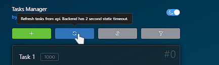
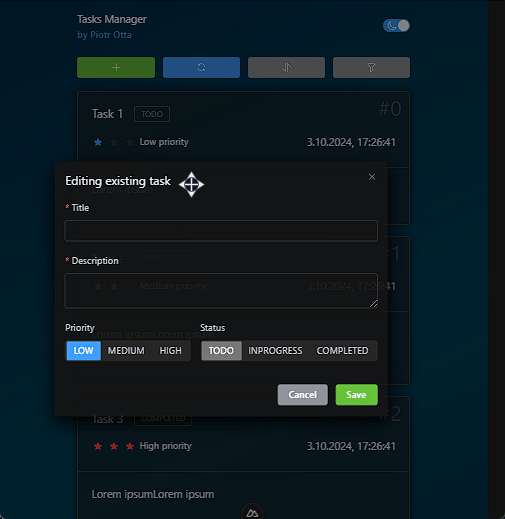

<h1 align="center">TaskManager app</h1>
<h2 align="center">by Piotr Otta</h2>


Made with


### Description

TaskManager allows organisation of created tasks. Tasks are organized with key attributes including title, description, creation date, priority, and status. The app enables users to:

-   Add, edit, and delete tasks.
-   Sort tasks by priority or creation date.
-   Filter tasks by status and priority.

Additionaly, app features dark and light themes.

App's backend has static delays to allow frontend loading capabilities.

### App showcase

#### Add and edit tasks


#### Sort and filter tasks


#### Themes


#### Notifications



#### Movable dialogs



### Used technologies

-   Node v20.17.0

-   npm 10.8.2

-   **Programming editor**: VScode

## Setup

Install the dependencies for both frontend and backend:

```bash
npm run install:all
```

or just just npm install in root folder and in backend folder:

```bash
npm install && cd backend && npm install && cd..
```

## Then run the app

Run the frontside app alongside backend:

```bash
npm run dev:all
```

or run individually frontend (root folder TaskManager_PiotrOtta) and backend (folder named backend):

```bash
npm run dev
```
